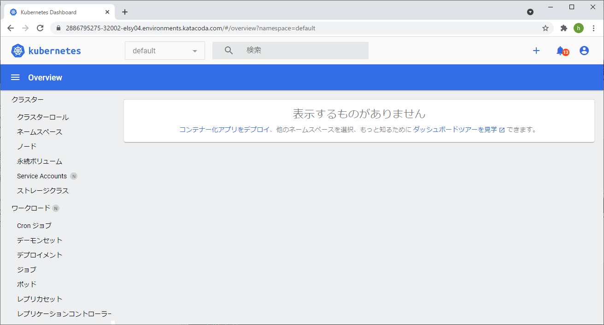

# ダッシュボードの認証方法
**<span style="color: red; ">【masterノードで実施（Terminal Host 1）】</span>**  

ダッシュボードをtokenで認証し、ログインします。  

①権限は細かく分かれており、デフォルトで色々な種類があります。「**kubectl**」コマンドを使用して「**deployment-controller**」権限でログインを試みます。  
$ `kubectl -n kube-system get secret | grep deployment-controller-token`{{execute HOST1}}  
**（表示例）**
```
deployment-controller-token-xxxxx   kubernetes.io/service-account-token 3       45m
```  
②「deployment-controller-token-xxxxx」を指定して、tokenを取得します。  
$ `kubectl -n kube-system describe secret deployment-controller-token-xxxxx`  
**（表示例）**
```
Name:         deployment-controller-token-xxxxx
Namespace:    kube-system
Labels:       <none>
Annotations:  kubernetes.io/service-account.name: deployment-controller
              kubernetes.io/service-account.uid: xxxxxxxx-xxxx-xxxx-xxxx-xxxxxxxxxxxx

Type:  kubernetes.io/service-account-token

Data
====
ca.crt: 1115 bytes
namespace: 11 bytes
token: xxxxxxxxxxxxxxxxxxxxxxxxxxxxxxxxxxxxxxxxxxxxxxxxxxxxxxxxxxxxxxxxxxxxxxxxxxxxxxxxxxxxxxxxxxxxxxxxxxxxxxxxx
```  
③上記の「**token:**」以降の文字列（xxxxの部分）をマウスで選択し、コピーします。   
④現在、ダッシュボードに表示されている「Kubernetes Dashboard」のウインドウ上のラジオボタン「**トークン**」をチェックし、下段の「**トークンを入力**」に②でコピーした文字列をペーストして「**サインイン**」ボタンをクリックします。  

**（表示例）**  
  

