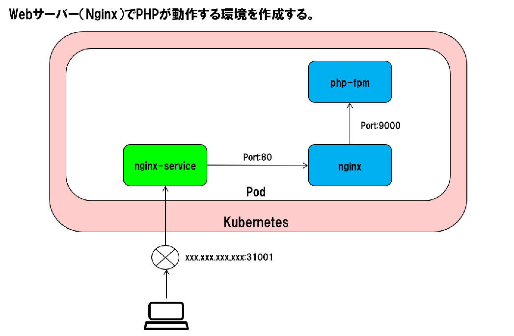

# ＜今回の目標＞
## 【Pod（アプリケーション）作成】  
- kubernetes上に静的WebサービスのPodを作成する。  
- Podの動作確認を実施する。  
- kubernetesの動作確認を実施する。（スケール、セルフヒーリング）   

※Katacoda利用のハンズオンの場合、必ずブラウザはChromeを使用すること。  
 

## 【Pod作成イメージ】  

  

- kubernetesのクラスター上のPodにはnginxとphp-fpmのコンテナと２つで構成されている。  
    - nginx：静的Webサービス（webサーバー）
    - php-fpm：PHP（動的にWebページを生成することができるスクリプト言語）のFastCGI実装のひとつ。FastCGIはWebサーバー上でユーザープログラムを動作させる仕様のひとつです。  
- ユーザーが外部アドレス（xxx.xxx.xxx.xx:31001）にブラウザ等からアクセスするとサービス（nginx-service）を介して、nginxにアクセスします。  
    - ページが「\*.html」の場合はnginxで処理し、応答を返します。  
    - ページが「\*.php」の場合はnginxからphp-fpmに処理を依頼し、その応答をnginxからユーザに返します。  
 

## 【ノード構成】  

- 本来は、registryノードはKubernetesクラスターの外にあり、Pod生成時にコンテナイメージのpullリクエストを行います。  
- 本レッスンでは、外部にregistryノードをデプロイすることが出来ないため、masterノードに間借りしてregistryコンテナを起動し構成します。   
※手順において、本来、registryノードのIPアドレスを指定しなくてはいけない所にmasterノードのIPアドレスを設定しているため、注意してください。  
