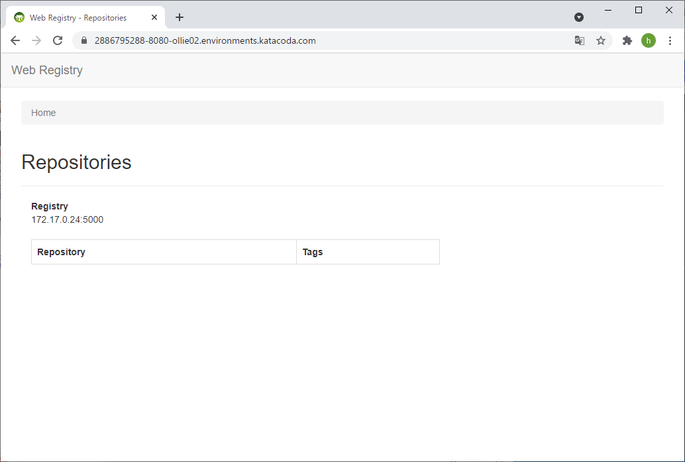

# プライベートレジストリのWeb-UIの構築
プライベートレジストリで管理されているコンテナイメージの参照・削除などはWeb-UIを構築することで可能となります。  

**【registryノードで実施】※本レッスンではmasterノードで実施します。**  

①プライベートレジストリのWeb-UIのコンテナイメージをパブリックレジストリからpullします。  
\# `docker pull hyper/docker-registry-web`{{execute HOST1}}  

②パラメータを指定して、Web-UIのコンテナイメージを起動します。（「xxx.xxx.xxx.xxx」はregistryノードのIPアドレスを指定します。※但し、本レッスンではmasterノードのIPアドレスを指定してください。）  

\# `docker run -d -p 8080:8080 -e REGISTRY_URL=http://xxx.xxx.xxx.xxx:5000/v2 -e REGISTRY_NAME=xxx.xxx.xxx.xxx:5000 -e REGISTRY_READONLY=false hyper/docker-registry-web:latest`{{copy}}   

④ブラウザからアクセスする場合のURLは下記の通りです。  

`http://xxx.xxx.xxx.xxx:8080`  

**KatacodaのWebアクセス方法：**  
①ターミナルペインの「**Terminal Host 1**」のタグの隣の「**＋**」をクリックします。  
②表示されるドロップリストから「**Select port to view on Host 1**」をクリックします。  
③ボックスに「**8080**」を入力し、「**Display Port**」をクリックします。  

**（表示例）**  
  