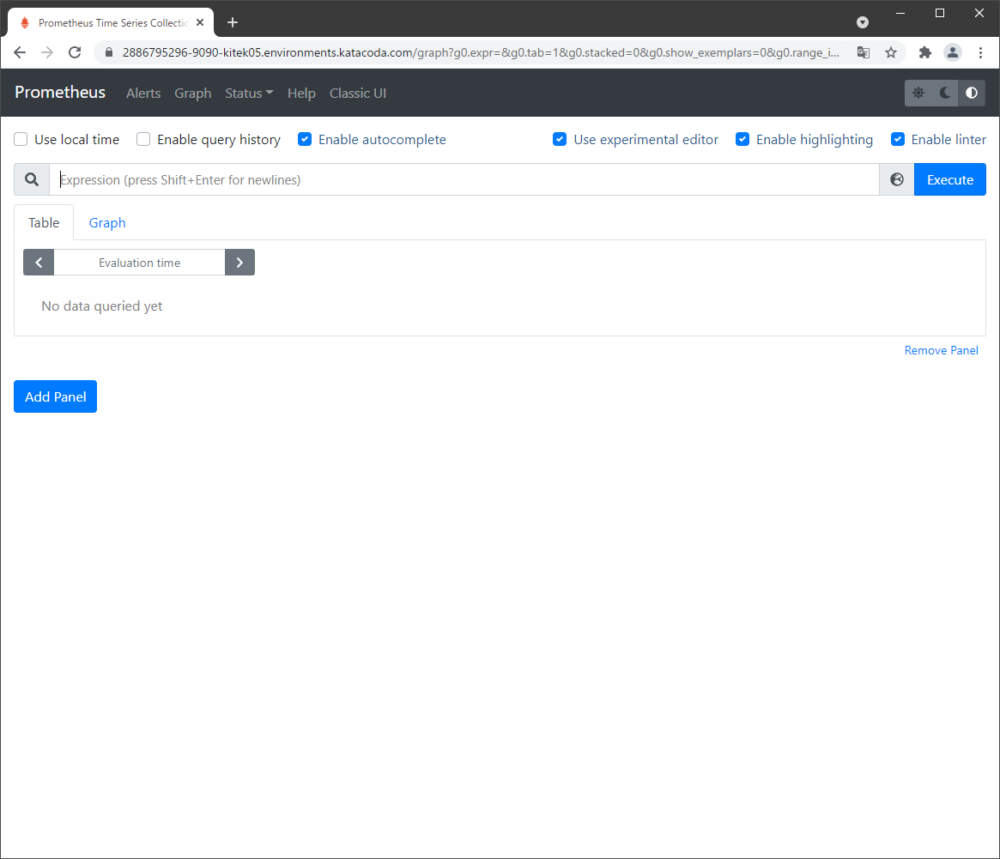
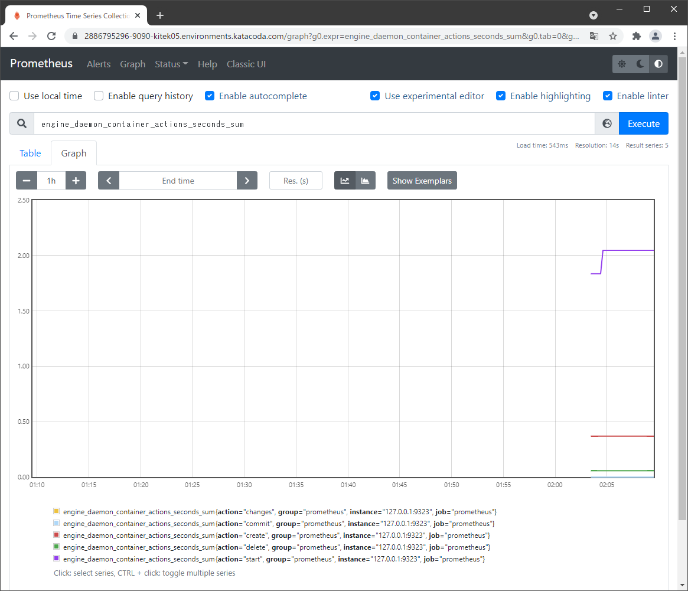
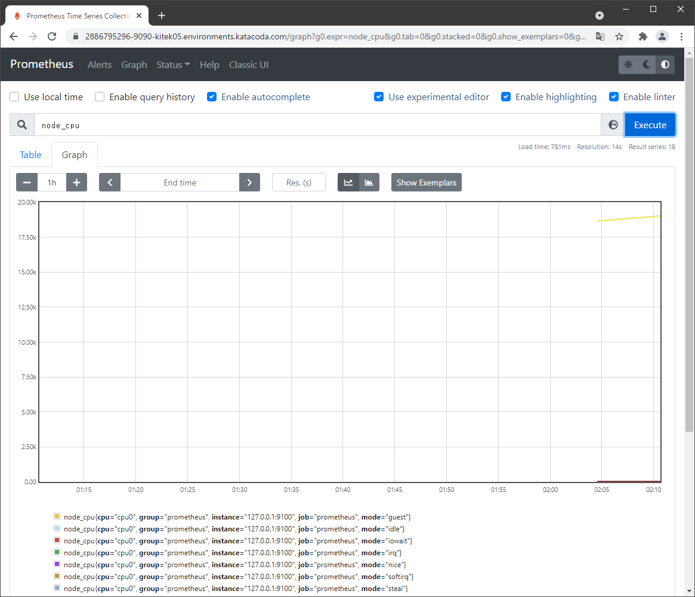
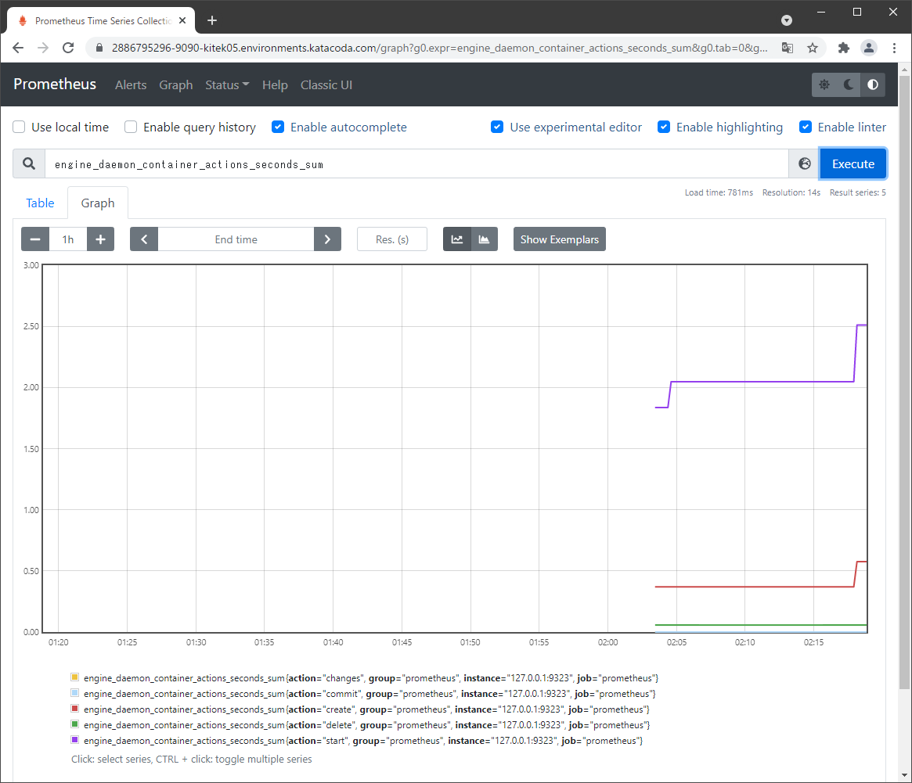

# 観測値の表示#2  
コンテナが起動すると、prometheusは構成の内部に基づいてデータを取得し、格納します。  

- ダッシュボードのグラフページにアクセスしてください。  
https://localhost:9090/graph

**KatacodaのWebアクセス方法：**  
①ターミナルペインの「**Terminal Host 1**」のタグの隣の「**＋**」をクリックします。  
②表示されるドロップリストから「**Select port to view on Host 1**」をクリックします。  
③ボックスに「**9090**」を入力し、「**Display Port**」をクリックします。  

**（表示例）**  
  
 

基になるメトリックをクエリ（補足：クエリ＝要求）してグラフを作成するには、ダッシュボードのグラフページにアクセスしてください。ここから、名前に基づいてさまざまなメトリックを照会できます。  

たとえば、「engine_daemon_container_actions_seconds_sum」をクエリすると、実行されているDockerアクションの数が表示されます。これらのアクションは、開始、削除、作成、コミット、または変更されるコンテナです。 「node_cpu」を使用してクエリを実行すると、Docker Hosts CPU情報が出力されます。  

- クエリ（虫眼鏡マーク）に該当の言葉（「engine_daemon_container_actions_seconds_sum」等）を入力し、「Execute」→下部のタグ「Graph」をクリックする。  

**（表示例）**  
engine_daemon_container_actions_seconds_sum  
 
node_cpu  
   
 
追加のコンテナを実行すると、生成されるメトリックが変更され、グラフとクエリで表示できます。  

- メトリックを生成する。  
\# `docker run -d --name http-server katacoda/docker-http-server:latest`{{execute}}  

**（表示例）**  
engine_daemon_container_actions_seconds_sum  
 
node_cpu  
   
 

次のStepの為に、コンテナを停止させます。  
\# `docker stop prometheus-server`{{execute}}  
\# `docker stop prometheus`{{execute}}  
\# `docker stop http-server`{{execute}}  