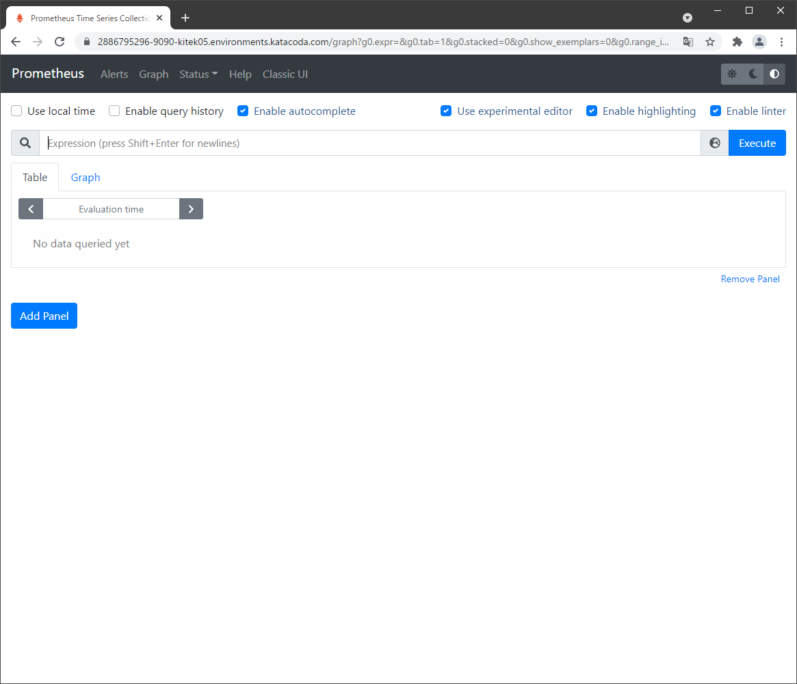

# prometheusのスタート#1
prometheusは、ポート9090で使用可能なUIを備えたdockerコンテナとして実行できます。prometheusは、ダッシュボード、グラフ化、アラートを可能にするAPIを介して使用できるようにします。その前に、構成を使用してターゲットから周期的にメトリックを収集して保存します。  

\# `docker run -d --net=host -v /root/prometheus.yml:/etc/prometheus/prometheus.yml --name prometheus-server prom/prometheus`{{execute}}  

- コマンドは、prometheus構成でコンテナを起動します。 prometheusによって作成されたデータはすべて、ホストのディレクトリ/prometheus/dataに保存されます。そのため、コンテナを更新しても、データは保持されます。  

- prometheusを起動すると、ダッシュボードはポート9090で表示できます。  
 

**KatacodaのWebアクセス方法：**  
①ターミナルペインの「**Terminal Host 1**」のタグの隣の「**＋**」をクリックします。  
②表示されるドロップリストから「**Select port to view on Host 1**」をクリックします。  
③ボックスに「**9090**」を入力し、「**Display Port**」をクリックします。  

**（表示例）**  
  
